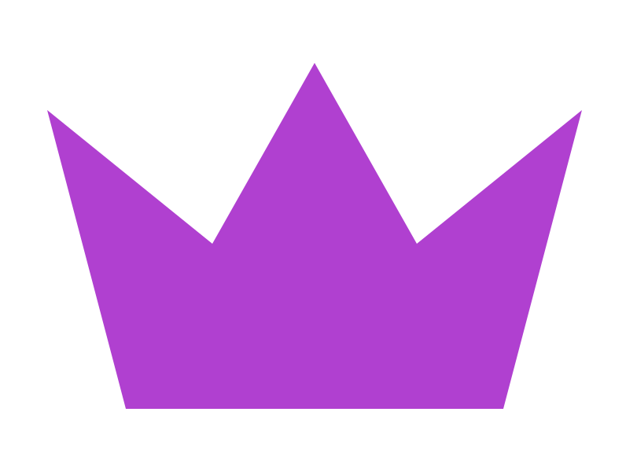
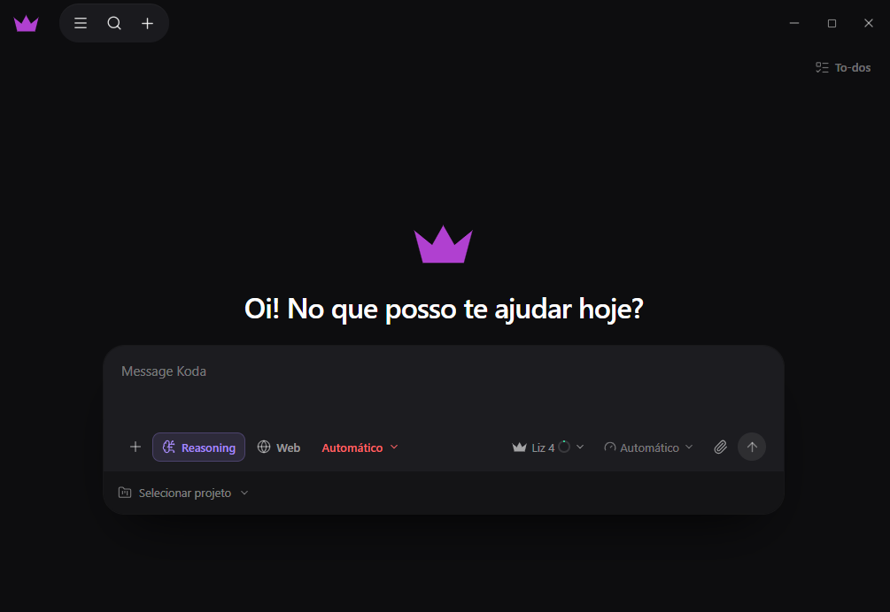

<p align="center">
  
</p>

<h1 align="center">Koda</h1>

<p align="center">
  Seu chat de código: conversa como gente, entende o projeto e faz a tarefa — com as
  ferramentas na mão.
</p>

<p align="center">
  
  
  
  
  
  
  
</p>

<p align="center">
  
</p>

---

> ### ⚠️ Projeto proprietário — uso proibido sem autorização
>
> Este repositório está público **apenas para leitura, consulta e avaliação**.
> **Usar, copiar, modificar, distribuir, treinar modelos com ele ou explorar
> comercialmente — no todo ou em parte — sem autorização prévia, expressa e por escrito do
> titular é proibido.** Até mesmo *fork* dentro do GitHub não concede licença de uso.
>
> Leia o arquivo **[LICENSE](LICENSE)** (a versão em português é a que vale) e, para pedir
> autorização, abra uma issue aqui ou fale com [@Panhard-Dev](https://github.com/Panhard-Dev).

---

## O que é o Koda

O Koda é uma área de código com cara de chat. Você escreve o que precisa — *"lista os
arquivos de `src/components`"*, *"esse teste está falhando, conserta"*, *"cria um script que
junta os CSVs dessa pasta"* — e ele **faz**, não só responde: lê e escreve arquivos, roda
comandos e Python, busca no código, pesquisa na web e mexe no git. Cada passo aparece na
conversa, com o que foi chamado, quanto tempo levou e o resultado atrás de um clique.

É um app para rodar no seu computador, com **os seus arquivos** e o **seu histórico** — o
que a tela mostra é o que fica guardado, então reabrir o Koda devolve a conversa inteira,
ferramentas incluídas.

## Modelos

O seletor mostra sempre o catálogo que o **host** publica, o mesmo em qualquer máquina. Sem
o host no ar, ele cai na lista da casa, que é esta:

| Família | Modelos |
| --- | --- |
| **Liz** | `Liz 4` (padrão) · `Liz 3 Flash` · `Liz Mini 2` · `Liz Mini 1.3` · `Liz Nano` |
| **Koda** | `Koda 1` |
| **Layze** | `Layze 2` |

- **A ordem é do maior para o menor**, e sai do próprio nome do modelo: o tier
  (`nano` < `mini` < `flash` < sem tier < `pro` < `max`) e, dentro do tier, a geração —
  `liz-4` → `liz-3-flash` → `liz-mini-2` → `liz-mini-1-3` → `liz-nano`. Modelo novo do host
  entra na lista sozinho, sem lista fixa no frontend.
- **Esforço de raciocínio, por modelo.** Ao lado do seletor de modelo há o de esforço —
  `Automático` (quem decide é o botão *Reasoning*), `Mínimo`, `Baixo`, `Médio` ou `Alto` — e
  cada modelo guarda o seu. Pergunta rápida num modelo leve, tarefa cabeluda num modelo
  grande, sem reconfigurar nada.
- **Contexto grande de verdade.** O teto é `KODA_CONTEXTO_TOKENS` — **1 milhão** por padrão,
  a janela dos modelos — e passou disso o Koda **compacta** a conversa (saídas antigas viram
  uma linha, o miolo resolvido vira resumo) em vez de estourar.
- **Ou traga o seu provedor.** Com `OPENAI_API_KEY` e `OPENAI_BASE_URL` o backend fala com
  qualquer serviço OpenAI-compatível — OpenAI, Groq, OpenRouter, Ollama em `/v1`. Sem chave,
  quem responde é o provider local, offline e explícito.

Os modelos da casa vêm do **host** (`host/c-host.exe`), que é proprietário e distribuído à
parte — sem ele o app continua de pé, respondendo offline em vez de fingir que está pensando.

## Comece agora

> **Nota**
> O repositório está no ar para leitura, consulta e avaliação. Rodar na sua máquina para
> conhecer é isso mesmo; **usar de verdade** depende de autorização (ver [LICENSE](LICENSE)).

Requisitos: **Node 20+**, **Python 3.11+** (o backend usa [uv](https://docs.astral.sh/uv/))
e, no Windows, o WebView2 — que já vem no Windows 11.

```bash
npm install

npm run dev          # interface em http://localhost:5173
npm run lint         # checagem estática
npm run build        # build de produção

npm run dev:api      # backend em http://127.0.0.1:8787  (opcional)
```

Todas as variáveis do backend são opcionais — sem nenhuma ele já roda com o provider local e
o banco em `backend/data/koda.db`. Para ajustar, copie `backend/.env.example` para
`backend/.env`: lá estão o provedor, o teto de contexto, as ferramentas e a nuvem.

## App desktop

A mesma interface empacotada como aplicativo nativo — Tauri 2 + WebView2, com ícone e janela
próprios. No Windows:

```bash
npm run app          # janela em modo dev (usa o Vite com HMR)
npm run app:build    # instalador NSIS + exe em src-tauri/target
```

O instalador exige o binário proprietário `host/c-host.exe`, que não é versionado no Git.
`npm run app:build` valida o arquivo antes de gerar o pacote e falha com o caminho esperado se
ele não estiver presente; a etapa de release deve provisionar o binário oficial nessa pasta.

Ao abrir, o app sobe as duas peças da conversa, nesta ordem, e **encerra as duas quando
fecha**:

1. o **host** (`host/c-host.exe`), o serviço dos modelos oficiais — ele vai **dentro do
   instalador** (recurso `host/` do bundle) e o app o encontra ao lado do próprio exe;
2. o **backend** (`uvicorn`), procurado como `backend/.venv/Scripts/python.exe` na árvore do
   projeto. A porta é escolhida na abertura — efêmera no app instalado, `8787` no dev — e vai
   para a interface junto com o **token da execução**, os dois por `invoke`.

O backend só aceita quem apresenta esse token: é o que impede o código que o agente executa
de chamar a própria API e se dar o modo `auto`. Se já houver algo na porta, o launcher faz um
desafio (nonce + HMAC) antes de reutilizar — backend de uma execução anterior nunca prova
conhecer o token novo, e sai da frente em vez de ser adotado. Sem o backend a interface entra
no modo offline dela.

Para usar a interface no **navegador** (sem o app desktop) contra um backend à mão, o
backend imprime o token ao subir e a interface o recebe em `VITE_API_TOKEN`.

## Recursos

- **Ele executa, não improvisa.** 37 ferramentas: ler, criar, editar, mover, copiar, renomear
  e apagar arquivos e pastas, aplicar um diff inteiro de uma vez, rodar comandos, rodar um
  trecho de código (Python ou JavaScript) e conferir sintaxe, procurar arquivo por nome ou
  trecho de código, ler páginas e pesquisar na web, instalar dependência e trabalhar com git
  — inclusive commitar. O modelo recebe o resultado real de cada ferramenta antes de
  responder, em vez de imaginar o que tem na pasta.
- **Tarefa grande vira plano, e o plano aparece.** Quando o pedido tem várias partes, o Koda
  divide em itens **antes** de mexer em qualquer coisa e mostra a lista na conversa — com o
  que já foi feito riscado, o que está rodando girando e o quanto falta no cabeçalho.
- **Ele não para no meio do caminho.** Quatro portões de parada seguram a conversa antes de
  ela fechar: lista com item em aberto, código mudado sem nada ter sido executado depois,
  fechamento que **promete** o próximo passo (*"vou deletar o bench…"*) e tarefa de ação em
  que nenhuma ferramenta funcionou.
- **Prometer não é fazer — e o Koda cobra.** Quando o modelo escreve "Vou confirmar que está
  respondendo:" e encerra sem chamar nada, a frase é lida como anúncio de qual ferramenta
  faltou ("confirmar" virou `shell`, "abrir" virou o comando do sistema) e o Koda **executa**
  o passo prometido em vez de aceitar a promessa. Se o modelo insistir no texto, ele recebe a
  cobrança com a ferramenta nomeada dentro do próprio histórico e **reengaja**; só depois
  disso, esgotadas as tentativas, a conversa fecha — sempre dizendo o que faltou, se algo já
  foi para o disco e oferecendo "continue", com um botão **Continuar** na faixa da resposta.
  Nenhuma parede sem saída: o caminho de "me diga continue" virou a última instância, não a
  primeira.
- **Permissão antes de mexer na máquina.** Três modos no campo de mensagem: `Manual`
  (pergunta antes de comando, escrita, exclusão e saída da pasta), `Default` (pergunta só no
  que é difícil de desfazer) e `Auto` (não pergunta). Dá para aprovar uma vez ou para sempre.
- **Você acompanha o trabalho, não o silêncio.** Enquanto o Koda pensa, a coroa da marca
  atravessa a tela com um brilho; cada ferramenta vira uma linha com o seu próprio desenho,
  acendendo enquanto roda. O texto chega sendo escrito e o botão de parar interrompe na hora
  — o que já saiu continua na conversa.
- **Sua cara, sua tela.** Tema claro, escuro ou seguindo o sistema; quatro cores de destaque;
  três fontes; tamanho da interface; e uma opção para reduzir animações. A tela de Ajustes
  traz ainda a **conta**, o **uso** — com os limites diário, semanal e mensal e um mapa de
  atividade do ano — e um **Sobre** que diz onde tudo é guardado.
- **Feito em português.** A interface, as respostas e os rótulos das ferramentas (`Listar
  pasta`, `Rodar Python`, `Escrever arquivo`) são em `pt-BR` — e o agente também entende os
  nomes que outros agentes usam (`run_command`, `list_directory`, `apply_patch`), porque
  quem escreve o nome é o modelo, não a interface. Dá para anexar arquivos, ditar pelo
  microfone em `pt-BR` e buscar dentro do histórico.
- **Acessível e navegável pelo teclado.** Todos os menus respondem a `↑` `↓` `Enter` `→` `←`
  `Esc`, com `aria-expanded`, `aria-pressed` e `role="menu"` onde precisa.

## Como funciona

Três peças, todas na sua máquina:

| Peça | O que é | Onde |
| --- | --- | --- |
| **Interface** | React 19 + Vite 8 + Tailwind 4 | `src/` |
| **Backend** | FastAPI + SQLite: agente, ferramentas, histórico | `backend/`, porta efêmera (8787 em dev) |
| **Host** | Serviço dos modelos (proprietário, à parte) | `host/c-host.exe`, porta `21128` |

O backend é quem conversa com o modelo e executa as ferramentas; a interface só mostra o que
ele manda. O app desktop é a mesma interface dentro de uma janela Tauri, com o app subindo e
encerrando o host e o backend junto de si.

## Como saber que está tudo de pé

Um comando roda os três portões de verdade — tipos, lint e a suíte do backend:

```bash
npm run verificar
```

A interface não tem suíte de testes: o que se pode quebrar nela é layout, e layout se confere
**olhando**. Em vez de um framework, existe uma bancada visual em duas páginas:

| Página | O que faz |
| --- | --- |
| `chat.html` | Monta a conversa com conteúdo hostil de propósito — o prompt gigante, um BLOB em base64 sem uma única quebra, caminho do Windows, URL comprida, linha de código de 900 caracteres, tabela larga, anexos de nome enorme, emoji, CJK e acentos. Sem parâmetro, roda os quatro cenários em fila; `chat.html?cenario=misto` prende a tela em um só (o último da fila é o controle `regressao`, e olhar para ele achando que é o app é um jeito fácil de se enganar). |
| `bench.html` | Repete a conversa na matriz toda: **15 larguras × 2 alturas × 3 escalas = 90 quadros**, quatro de cada vez, e escreve o veredicto em `window.__bench`. |

Com o `npm run dev` no ar, abra `http://localhost:5173/bench.html` e espere a frase *medição
concluída*. O que se cobra é `casosFalhos: 0`, `controleDetectou: 90` e `inconclusivos: 0`.

O detector ([`harnessChat.tsx`](src/harnessChat.tsx)) trata os dois eixos de forma diferente,
porque valem coisas diferentes: **na largura** qualquer transbordo é suspeito — rolar de lado
é o sintoma, cortar de lado é o sintoma escondido —, enquanto **na altura** rolar é o desenho
(a coluna da conversa, o `<textarea>`, a caixa de raciocínio) e o que não pode é *cortar*.
Três coisas contam como desenho e não como defeito, cada uma com o seu porquê no código: o
`sr-only` de acessibilidade, o `truncate` que guarda o valor inteiro no `title` e o bloco de
código e a tabela que rolam por decisão de projeto.

A bancada tem um **controle de regressão**: um cenário monta a bolha e a fala do modelo com
as classes antigas, sem `min-w-0` e sem `break-words`. Se ele passar, o detector está cego e o
resto do resultado não vale nada. Foi assim que esta bancada se provou: ela reprovou o
controle em 90 de 90 quadros.

## Comunidade

Dúvida, ideia ou quer saber o que vem por aí? O lugar é o nosso Discord:
**[discord.gg/NwJdnpbgAg](https://discord.gg/NwJdnpbgAg)**.

## Problemas e sugestões

Achou um bug, quer sugerir algo ou pedir autorização de uso? Abra uma
[issue](https://github.com/Panhard-Dev/koda/issues) no repositório, ou fale com
[@Panhard-Dev](https://github.com/Panhard-Dev).

## Privacidade e dados

- **A conversa fica com você.** O histórico e a contagem de uso ficam num SQLite local
  (`backend/data/koda.db`), na sua máquina. Nada sai daqui para responder.
- **Sem telemetria.** O Koda não manda uso, aceite nem rejeição de resposta para lugar nenhum.
- **A nuvem é opcional e vem desligada.** Ela serve só para o aviso de atualização, o
  changelog e o catálogo publicado — e é consultada quando a tela pede
  (`KODA_CLOUD_CHECK_ON_START=off`). Sem resposta da nuvem, o app segue igual.
- **A sua chave, no seu arquivo.** Se você plugar um provedor OpenAI-compatível, a chave fica
  no `.env` local e viaja só no cabeçalho da chamada — nunca na URL, nunca em log.

## Licença e autorização de uso

**Projeto proprietário. Todos os direitos reservados.** Este repositório é público para
leitura e avaliação; **qualquer uso sem autorização prévia, expressa e por escrito do titular
é proibido** — inclusive executar, copiar, modificar, distribuir, treinar modelos de IA com o
código, usar a marca ou explorar comercialmente. O texto completo, com as definições e as
consequências, está em **[LICENSE](LICENSE)**.

Para pedir autorização: abra uma issue neste repositório ou fale com
[@Panhard-Dev](https://github.com/Panhard-Dev).

Copyright (c) 2026 Panhard-Dev.
